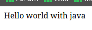
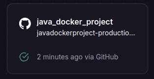
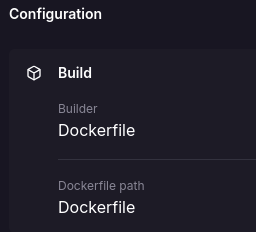
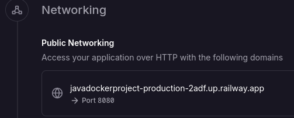

# Hello world whit java
## Results
<p align="center">
    
</p>

Web application that deploys a web server using spring boot and sets up a simple api with a get route that displays the message **hello world with java**

## :open_book: How to use
### Pre-requisites
   * Intellij IDEA
   * jdk-17
   * maven
---

* Clone the repository
    ```
    git clone https://github.com/Pablo-man/java_docker_project.git
    ```
* Open the program with the Intellij IDEA editor
* Using the integrated maven tool in the editor, load the project dependencies and clean the program.
* Go to the DemoApplication.java class and run the main class
* Visit your `localhost:8080` to view the results

    > [!TIP]
    > By default the application will be deployed on port `8080`, if it is necessary to change it to another one you must include the following code `server.port=<PORTNUMBER>` in your configuration file **application.properties**

## :rocket: How to run with docker
Visit the following link to learn about the process of generating the project image

:whale2: [GO](https://hub.docker.com/repository/docker/pamendeza/java_docker_project "Docker steps")

## :light_rail: PAAS Deploy(Railway)
For its deployment in a PAAS we will rely on railway and its easy implementation thanks to its container management. 



The platform automatically uses our Dockerfile to build the container. 



> [!IMPORTANT]
> Next, the configuration that we must add is the generation of a domain along with the desired port, in this case the indicated thing would be to point to port 80 on which nginx is working



[Hello World](https://jsproyectdocker-production.up.railway.app "click for visit")